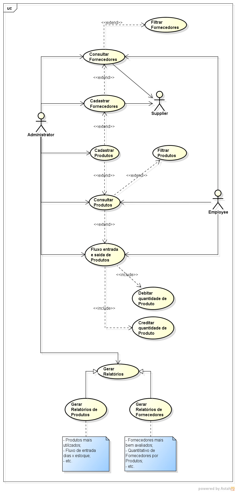
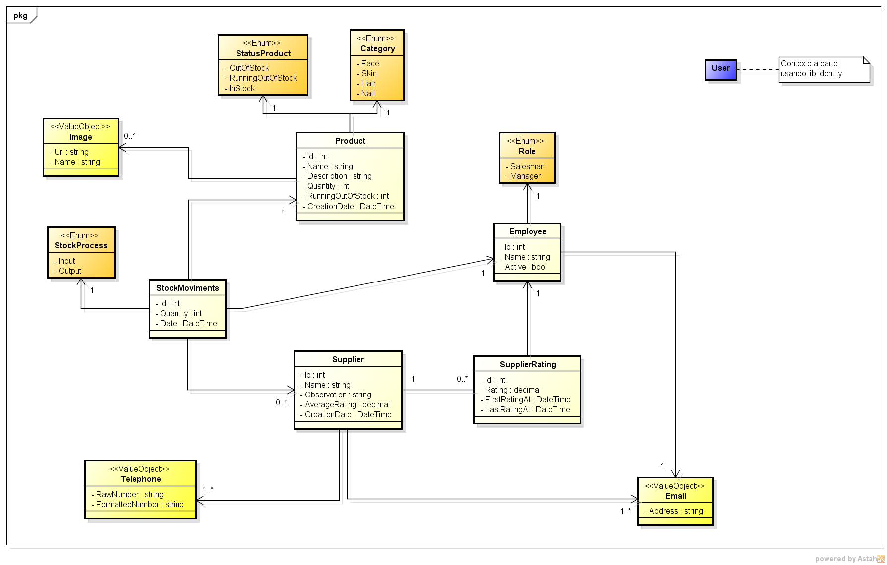

# Beauty Control com VSA (Vertical Slice Architecture)

Este projeto foi desenvolvido na faculdade de Bacharelado Sistemas de Informação, IFES Campus Serra. A ideia deste novo repositório é centralizar todo código fonte, modelagem e demais artefatos em único repositório, assim como também aplicar o estilo arquitetural chamado **Vertical Slice Architecture**. Abaixo contém as referências do projeto:

- [Artefatos](https://github.com/HaraHeique/LES-artefatos-beauty-control);
- [Front-end](https://github.com/LarissaMotta/devweb-front-end);
- [Back-end](https://github.com/LarissaMotta/devweb-back-end).

## Descrição Geral

Com o aumento da procura por procedimentos voltados para área de beleza, nota-se a dificuldade de controlar a entrada e saída de produtos de beleza e o gerenciamento de fornecedores de produtos em salões de beleza,  o sistema proposto tem o objetivo principal facilitar o controle sobre o estoque e a busca de fornecedores.

O sistema será na plataforma web e conterá dois tipos de usuários, os quais são:
* Gestores - Dono do negócio e/ou gerente (quem compra produtos, mexe no estoque);
* Vendedores - Quem utiliza e/ou vende produtos para o dono do negócio.

O gestor administra o cadastro dos produtos, assim como fornecedores para sua carteira, podendo deixar essa informação disponível para outros administradores.
O vendedor registra a entrada e saída dos produtos, a partir da utilização nos procedimento estéticos ou venda para clientes.

Além disso o gestor também terá a possibilidade de avaliar o serviço prestado pelos fornecedores, a fim de tomadas de decisões no momento de escolher os fornecedores para compra de seus produtos, o que consequentemente provê maior excelência nos seus serviços prestados nos salões de beleza ou estabelecimentos similares.

Também será possível visualizar as métricas em geral do negócio para fins analíticos por meio de gráficos e geração de relatórios, como: movimentações de estoque (entrada e saída de produtos), quantidade de usuários por roles, fornecedores mais bem avaliados, quantidade de produtos adquiridos por fornecedor e afins.

## Modelagem

Abaixo conterá os diagramas da modelagem estrutural e comportamental.

### Comportamental - Casos de Uso

### Estrutural - Diagrama de classes

## Vertical Slice Architecture

O Vertical Slice Architecture é considerado um estilo arquitetural que se preocupa com dois aspectos fundamentais em arquitetura de software:

- **Acoplamento**: grau de dependência entre elementos em um software;
- **Coesão**: grau em que os elementos dentro de um software pertencem juntos (correlação forte e direta entre os elementos).

Assim diferentemente das arquiteturas em camadas, e suas variações, das quais se preocupam demasiadamente em acoplamento (*direction dependencies* e [*separtion of concerns*](https://blog.cleancoder.com/uncle-bob/2012/08/13/the-clean-architecture.html)), o Vertical Slice também se preocupa com o acoplamento, mas com foco especial na coesão.

Isto se dá devido o demasiado foco nas **capacidades do negócio**, ou seja, no que a aplicação faz e provê para o negócio. Logo acaba sendo ideias para sistemas que **atacam o problema do domínio que é desejado resolver**, dos quais são a grande maioria no mercado. Como consequência dessas características a forma como o código é estruturado muda, passando a ser **organizado por *features*** ao invés de ser por *layers*. 

Abaixo contém uma tabela comparando as N arquiteturas em camadas em relação ao Vertical Slice:

N Layers (Clean, Hexagonal, Onion, 3 layers e afins)|Vertical Slice Architecture
---|---
Foco demasiado em acoplamento|Acoplamento limitado no escopo da feature com foco demasiado em coesão
[*separtion of concerns*](https://blog.cleancoder.com/uncle-bob/2012/08/13/the-clean-architecture.html) (acoplamento e dependencies directions)|Coesão funcional (grupo relacionado de operações baseado em tarefas)
Separação em cada camada para permitir que elas mudem independentemente. Porém as alterações de único use case (feature) são feitas em todas as camadas juntas|Tudo que muda junto (features) fica/pertence junto.
Médio/Alto uso de abstrações para manter as camadas internas “limpas” e isoladas do “mundo externo”|Baixo ou nenhum uso de abstrações. Caso use é mais para modularização e fácil uso de uma interface limpa, simples e amigável
Bom em cenários que há maior complexidade em produtos mais técnicos e que são usados por outros produtos|Bom em cenários que focam no domínio (core), onde as funcionalidades específicas do negócio são fundamentais (produto para cliente final)
Foca mais em **technical concerns** (preocupação técnicas)|Foca mais em **business concerns** e capabilities (preocupações nas capacidades do negócio)
Organização estrutural do código **por camadas**|Organização estrutural do código **por features**

Abaixo um conjunto de referências e fontes sobre Vertical Slice Architecture:

- [Fontes extraídas e agrupadas em único arquivo PDF no projeto](./docs/Referencias/Fontes%20Vertical%20Slice%20Architecture.pdf);
- [Jimmy Bogard - Vertical Slice Architecture](https://jimmybogard.com/vertical-slice-architecture/);
- [Derek Comartin - Restructuring to a Vertical Slice Architecture](https://codeopinion.com/restructuring-to-a-vertical-slice-architecture/);
- [How to Implement Vertical Slice Architecture](https://garywoodfine.com/implementing-vertical-slice-architecture/);
- [Vertical Slice Architecture in ASP.NET Core](https://code-maze.com/vertical-slice-architecture-aspnet-core/);
- [Tired of Layers? Vertical Slice Architecture to the rescue!](https://www.youtube.com/watch?v=lsddiYwWaOQ&list=PLfq-iighJjSH7qsHi_IFZt2ySa27KZQZ9&index=8);
- [Github - Vertical Slice Architecture example in .NET 7](https://github.com/nadirbad/VerticalSliceArchitecture).

## À Fazer

Abaixo uma lista de à fazeres no projeto:

- Atualizar para [versão mais recente do .Net e linguagem do C#](https://dotnet.microsoft.com/pt-br/download) até mesmo usando as versões preview;
  - Aproveite aqui para aprender e utilizar as novas features do ASP.NET Core;
  - Aproveita aqui para aprender e utilizar as novas features do C#.
- Dividir a aplicação em contextos delimitados (DDD pattern), onde cada contexto representa um subdomínio alinhado com as intenções, necessidades e conhecimento do negócio. Cada subdomínio é tratado como uma aplicação à parte e isolada (indepentende), contendo um conjunto de funcionalidades que pertencem juntas (coesas);
  - Pode-se utilizar um estilo arquitetural como o monolíto modular (também conhecido como losing coupled monolith);
  - Inicialmente pode-se dividir entre: Identidade (Técnico), Report (Técnico), XXXXX (Negócio);
  - Detalhes de como definir Bounded Contexts: https://learn.microsoft.com/pt-br/dotnet/architecture/microservices/architect-microservice-container-applications/identify-microservice-domain-model-boundaries
- Avaliar e desenvolver os TODO's que estão dentro do código fonte do back-end;
- Verificar se tem algum ponto que daria para usar cache
  - Neste caso usar o Redis;
  - Colocar cache na frente da aplicação ou do mecanismo de persistencia utilizado
- Verificar se daria para usar banco de dados NoSql
  - Neste caso pode ser usando MongoDB ou Redis;
  - Muito provavelmente NÃO PRECISA para esta aplicação literalmente, pois bases NoSql faz sentido quando temos alta escalabilidade, alta performance e alto volume de dados (ser schemeless também);
- Verificar se daria para usar um Search Engine
  - Neste caso pode ser usando o Elastic Search;
  - Usar aqui na ideia de ser um full-text search para busca e pesquisa em um grande volume de dados;
  - Provavelmente aqui literalmente NÃO PRECISA também.
- Adicionar o projeto Web do [Front-end](https://github.com/LarissaMotta/devweb-front-end) a este projeto, mudando o que for necessário;
- Fazer deploy da aplicação em alguma plataforma de computação em nuvem, tais como: Azure, Amazon AWS, Google Cloud e afins;
  - Configurar CI/CD usando o Github Actions que é fácil e já tudo centralizado no Github
- Criar/Ajustar o DOCKERFILE da aplicação back-end;
- Criar o docker-compose para todos os componentes envolvidos para facilitar a implantação e execução de todos os componentes necessários da aplicação;
- Adicionar configuração de [Health Checks](https://learn.microsoft.com/en-us/aspnet/core/host-and-deploy/health-checks?view=aspnetcore-8.0) na aplicação p/ os componentes de infraestrutura;
- Adicionar observalidade para a aplicação usando [OpenTelemetry](https://github.com/open-telemetry)
  - OpenTelemetry é muito bom, pois fornece uma padronização para geração, coleta e exportação de dados de telemetria, que são: logs, tracing e metrics;
  - Pode-se usar o .Net Aspire, onde ele fornece uma Stack production ready para aplicações distribuídas em conjunto com ferramentas de observabilidade;
- Implementar os testes automatizados na aplicação back-end levando em considerações as métricas de acomplamento e o que é sugerido pelo *Jimmy Bogard*:
  - Testes unitários: devem ser implementados em componentes mais críticos, estáveis e que **realmente contém lógicas**. Exemplos: modelos de domínios em geral (seja anêmico ou rico), utilitários e afins;
  - Testes de integração: aplicados a componentes menos estáveis, menos críticos e que atuam geralmente como orquestradores. Exemplos: nas bordas da aplicação geralmente (comunicação com componentes de infra), nos handlers comumemente conhecidos no Vertical Slice e em serviços **orquestradores** em geral.
  - OBSERVAÇÃO.: ao olhar para esses dois tipos de testes levar em consideração **a necessidade de criação mocks/stubs/fakers para geração dos testes**. Caso necessite talvez seja um indício forte da não criação de testes unitários para eles, dado que entregam pouco valor. Talvez nesses cenários os testes de integração entreguem mais valor e **realmente fazem a assertividade do teste no cenário proposto, evitando/minimizando falsos positivos**.
